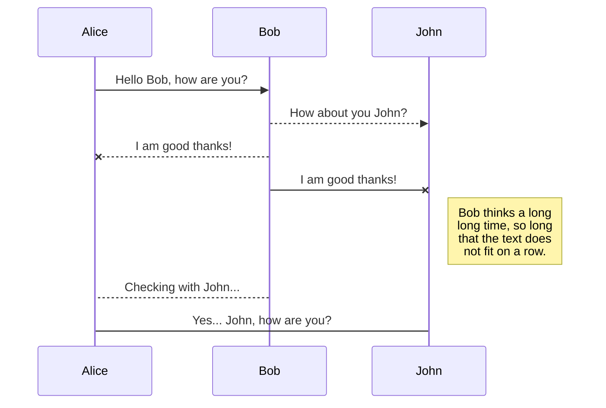
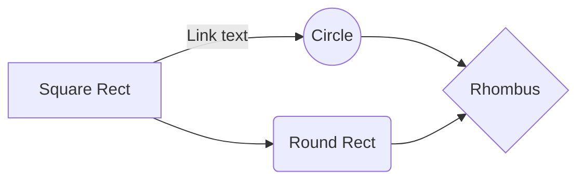

# Welcome to NEOVUE !
This **neovim** config was built with 2 main goals:
 - **Vue 3**: Vim is already faster than most with text editing. but how about trying to make the fastest and most efficient **Vue 3 Full IDE** ? With  **Autocompletion** like IntelliSense with **native LSP client** as well as total live **debbuging** capacity with **DAP**. While we are at it, why not throw in a few IntelliJ or VSCode shortcuts too! Such as the great **Incremental Selection** ( Ctrl-W ) or the classic **Auto-Formatiing on Save** and other extremely fast shortcuts, snippets and goodies to make you the fastest you have ever been ! 
 - **NixOS...** That's right! I'll show you how I wrapped neovim in it's own 'bubble' where you can inject all the Nix packages you want sur as Node, Volar, Lua_ls without ever polluting your machine !  (If you don't use NixOS then you will still see how to use this config)
# Files
To be continued

# Markdown extensions

StackEdit extends the standard Markdown syntax by adding extra **Markdown extensions**, providing you with some nice features.

> **ProTip:** You can disable any **Markdown extension** in the **File properties** dialog.

## SmartyPants

SmartyPants converts ASCII punctuation characters into "smart" typographic punctuation HTML entities. For example:

|                |ASCII                          |HTML                         |
|----------------|-------------------------------|-----------------------------|
|Single backticks|`'Isn't this fun?'`            |'Isn't this fun?'            |
|Quotes          |`"Isn't this fun?"`            |"Isn't this fun?"            |
|Dashes          |`-- is en-dash, --- is em-dash`|-- is en-dash, --- is em-dash|

## KaTeX

You can render LaTeX mathematical expressions using [KaTeX](https://khan.github.io/KaTeX/):

The *Gamma function* satisfying $\Gamma(n) = (n-1)!\quad\forall n\in\mathbb N$ is via the Euler integral

$$
\Gamma(z) = \int_0^\infty t^{z-1}e^{-t}dt\,.
$$

> You can find more information about **LaTeX** mathematical expressions [here](http://meta.math.stackexchange.com/questions/5020/mathjax-basic-tutorial-and-quick-reference).

## UML diagrams

You can render UML diagrams using [Mermaid](https://mermaidjs.github.io/). For example, this will produce a sequence diagram:

And this will produce a flow chart:

